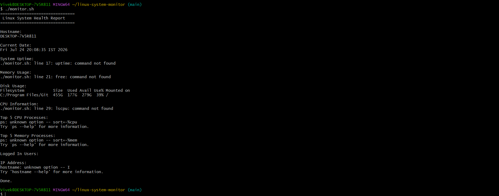

# Linux & System Monitor


A dual-tool system monitoring suite featuring a **Bash-based report generator** and a **Python real-time monitoring tool** that tracks CPU, memory, and disk usage with automated threshold alerts and activity logging.

---

## Features

### 🖥️ Bash System Health Report (`monitor.sh`)
- Displays system hostname
- Shows current date and time
- Displays system uptime
- Shows CPU information
- Displays memory usage
- Displays disk usage
- Lists top CPU and memory-consuming processes
- Shows logged-in users and system IP address

### ⚡ Python Real-Time Monitor (`monitor.py`)
- Continuous live tracking of CPU, memory, and disk percentages
- Custom threshold limit checks (triggers warnings if limits are exceeded)
- Automated activity and alert logging to `system_monitor.log`

---

## Technologies Used

- Python (`psutil`, `logging`, `time`)
- Bash
- Linux
- Git
- GitHub

---

## Skills Demonstrated

- System Administration & Automation
- Python Scripting & Error Handling
- Bash Scripting
- Real-Time System Monitoring & Alerting
- Log Management
- Git Version Control
- Project Documentation

---

## Project Structure

```
linux-system-monitor/
│
├── monitor.sh          # Bash health report script
├── monitor.py          # Python real-time monitor & alerter
├── system_monitor.log  # Generated system logs
├── README.md
├── LICENSE
├── .gitignore
└── screenshots/
└── output.png
```

---

## Linux Commands Used (Bash Script)

| Command | Purpose |
|----------|----------|
| `hostname` | Displays the system hostname |
| `date` | Displays current date and time |
| `uptime` | Shows system uptime |
| `lscpu` | Displays CPU information |
| `free -h` | Displays memory usage |
| `df -h` | Displays disk usage |
| `ps aux` | Lists running processes |
| `who` | Displays logged-in users |
| `hostname -I` | Displays system IP address |

---

## Prerequisites

Before running the scripts, ensure you have:
- Linux (Ubuntu, Debian, Fedora, CentOS, etc.) or WSL
- Bash Shell
- Python 3.x with `psutil` installed
- Git

---

## Installation

### Clone the Repository

```bash
git clone [https://github.com/vivek65666/linux-system-monitor.git](https://github.com/vivek65666/linux-system-monitor.git)
```

### Navigate to the Project Directory

```bash
cd linux-system-monitor
```

### Make the Script Executable

```bash
chmod +x monitor.sh
```

---

## Usage

## Usage

### 1. Run the Bash Health Report (`monitor.sh`)

Make the script executable:
```bash
chmod +x monitor.sh

Run the script:

Bash
./monitor.sh
2. Run the Python Real-Time Monitor (monitor.py)
Install dependencies:

Bash
pip install psutil
Run the real-time monitor:

Bash
python monitor.py

## Sample Output

```text
=========================================
      Linux System Monitoring Tool
=========================================

Hostname        : DESKTOP

Date            : Thu Jul 24 20:30:12 IST 2026

Kernel Version  : 6.6.87.2-microsoft-standard-WSL2

Uptime          :
20:30:12 up 2:35, 1 user, load average: 0.15, 0.18, 0.12

CPU Information
Model name: Intel(R) Core(TM) i5 Processor

Memory Usage
              total        used        free      shared  buff/cache   available
Mem:          7.6Gi       3.1Gi       2.8Gi       180Mi       1.7Gi       4.1Gi

Disk Usage
Filesystem      Size  Used Avail Use% Mounted on
/dev/sda        250G   95G  143G  40% /

Top 5 CPU Processes
...

Top 5 Memory Processes
...

Logged-in Users
vivek

IP Address
172.20.120.1

System Report Completed Successfully.
```

---

Sample Python Output & Alerts
Plaintext
Starting System Monitor... Press Ctrl+C to stop.
[CPU: 22.9%] | [Memory: 81.8%] | [Disk: 38.9%]
⚠️  HIGH MEMORY USAGE ALERT: 81.8% exceeds 80.0%
[CPU: 22.8%] | [Memory: 81.4%] | [Disk: 38.9%]
⚠️  HIGH MEMORY USAGE ALERT: 81.4% exceeds 80.0%

## Screenshot

> Add your terminal screenshot to:

```
screenshots/output.png
```

Then it will appear below.



---

## How It Works

The script collects real-time system information using built-in Linux commands.

It retrieves:

- Hostname
- Current date and time
- System uptime
- CPU information
- Memory utilization
- Disk utilization
- Running processes
- Logged-in users
- IP address

The collected information is displayed as a formatted system health report.

---

## Future Improvements

- Export reports to HTML
- Export reports to PDF
- Generate CSV reports
- Email alerts for high CPU or memory usage
- Slack notifications
- Docker container support
- Cron job automation
- Log file generation with timestamps
- CPU and Memory threshold alerts
- Colored terminal output
- Interactive menu
- Monitoring dashboard using Grafana

---

## Example Cron Job

Run the monitoring script every day at **9:00 AM**.

Open crontab:

```bash
crontab -e
```

Add:

```bash
0 9 * * * /home/username/linux-system-monitor/monitor.sh
```

---

## Git Commands

```bash
git clone https://github.com/vivek65666/linux-system-monitor.git

cd linux-system-monitor

chmod +x monitor.sh

./monitor.sh
```

---

## Learning Outcomes

This project helped me learn:

- Linux command-line utilities
- Bash scripting fundamentals
- Linux system administration
- Process monitoring
- Memory and disk analysis
- Git and GitHub workflow
- Project documentation
- Open-source project structure

---

## Resume Highlights

- Developed a Bash-based Linux system monitoring tool to automate reporting of CPU, memory, disk utilization, uptime, running processes, logged-in users, and network information.
- Utilized native Linux commands to generate system health reports.
- Implemented version control using Git and GitHub with professional project documentation.

---

## Author

**Vivek C Raj**

- GitHub: https://github.com/vivek65666
- LinkedIn: https://www.linkedin.com/in/vivek-c-raj/

---

## License

This project is licensed under the **MIT License**.

See the [LICENSE](LICENSE) file for details.

---

## Show Your Support

If you found this project useful, consider giving it a ⭐ on GitHub!
